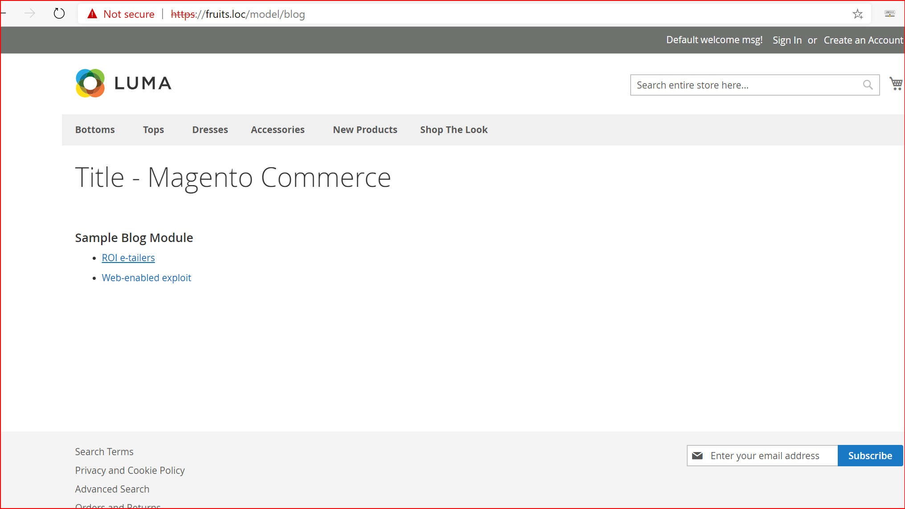
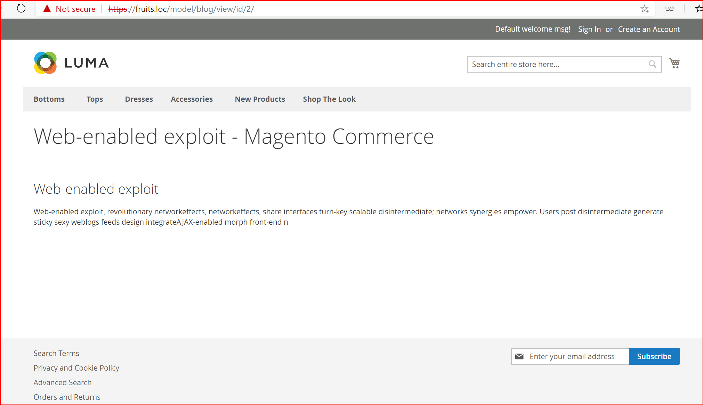
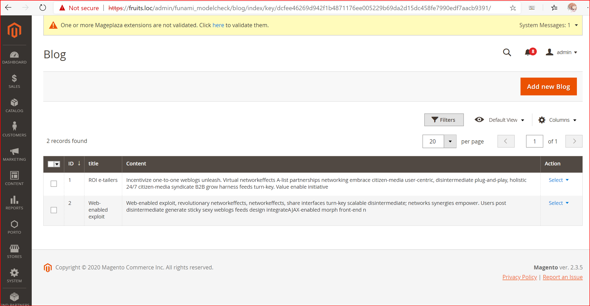
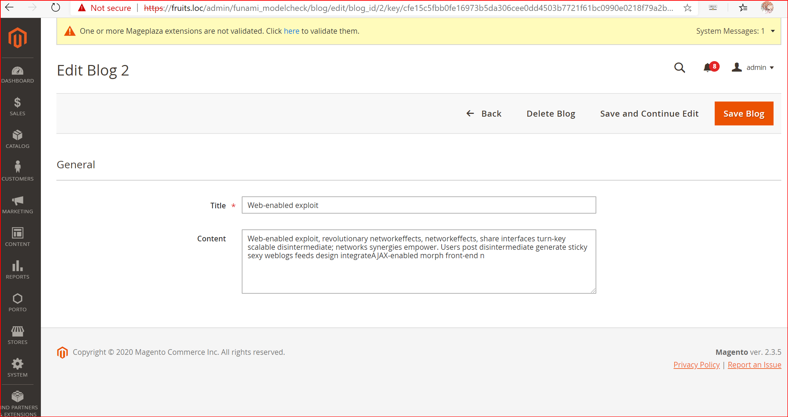

# Funami_ModelCheck Magento 2 Module

## Description

Basically it is a skeleton of Blog functionality. With admin and storefront blog list and blog view.
 Check screenshots below.

### Details

On admin side uiComponents were used.  
On storefront was done through phtml templates.

## Screenshots
#### Storefront blog list

#### Storefront blog view

#### Admin blog list

#### Admin blog view

